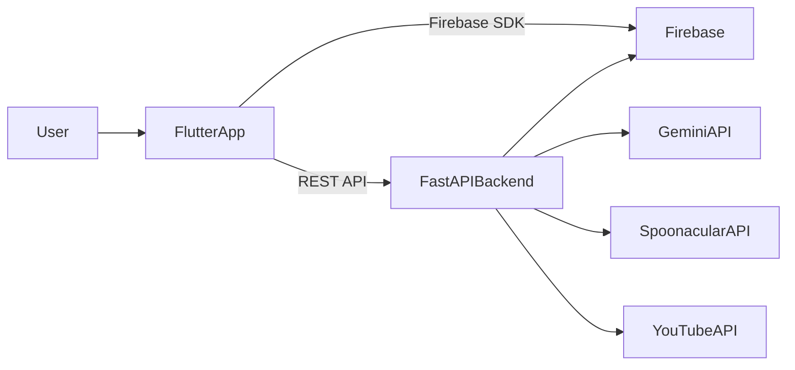

# 🍳 Cookgenix  
### AI-Powered Smart Cooking & Meal Planning App

Cookgenix is a full-stack mobile application that combines **Flutter** and **FastAPI** to deliver an intelligent cooking companion.

It helps users:

- 📷 Scan groceries and receipts  
- 🥫 Manage pantry inventory  
- 🧠 Generate AI-powered recipes  
- 📅 Plan weekly meals automatically  
- 🛒 Build smart shopping lists  
- 🎥 Find cooking videos instantly  

The goal: **reduce food waste, simplify meal planning, and make cooking smarter.**

---

## 🚀 Features

### 📷 Smart Scanning
- Scan food items using your camera
- Parse grocery receipts automatically
- AI extracts structured ingredients
- Intelligent ingredient normalization

### 🧠 AI Recipe Generation
- Generate recipes from cravings
- Create recipes from available ingredients
- Get structured cooking steps and summaries
- Integrated YouTube cooking videos

### 📅 Smart Meal Planner
- Generate full weekly meal plans
- Replace individual days dynamically
- Pantry-aware suggestions
- Cloud-based persistence

### 🛒 Shopping List Automation
- Detect missing ingredients
- Generate optimized shopping lists
- Sync with pantry inventory

---

## 🏗 Architecture Overview



---

## 🧩 Tech Stack

### 📱 Frontend
- Flutter (Dart)
- go_router
- Firebase Authentication
- Cloud Firestore
- Hive (local storage)
- flutter_dotenv

### ⚙ Backend
- Python 3.11+
- FastAPI
- Pydantic
- Firestore Admin SDK
- Uvicorn

### 🌍 External APIs
- Gemini API (AI & multimodal)
- Spoonacular (via RapidAPI)
- YouTube Data API

---

## 📂 Project Structure

```
MCH/
├── backend/                 # FastAPI backend
│   ├── app/
│   │   ├── api/             # Route handlers
│   │   ├── providers/       # External API integrations
│   │   ├── models/          # Pydantic schemas
│   │   ├── utils/           # Business logic helpers
│   │   ├── core/            # Firestore client setup
│   │   └── main.py
│   └── requirements.txt
│
└── my_cooking_helper/       # Flutter mobile app
    ├── lib/
    │   ├── features/
    │   ├── services/
    │   ├── models/
    │   ├── widgets/
    │   ├── theme/
    │   └── main.dart
    └── pubspec.yaml
```

---

## ⚙️ How It Works

1. User scans food or receipt in the Flutter app  
2. Image is sent to FastAPI backend  
3. Backend uses AI to interpret ingredients  
4. Ingredients are normalized and stored in Firestore  
5. User can:
   - Generate recipes
   - Create meal plans
   - Deduct ingredients after cooking
   - Build shopping lists

All heavy logic runs server-side for security and maintainability.

---

## 🔧 Local Development Setup

### 🔹 Backend Setup

```bash
cd backend
python -m venv .venv
source .venv/bin/activate  # Windows: .venv\Scripts\activate
pip install -r requirements.txt
uvicorn app.main:app --reload --port 8000
```

Access API docs:

```
http://localhost:8000/docs
```

---

### 🔹 Frontend Setup

```bash
cd my_cooking_helper
flutter pub get
flutter run
```

Make sure your `.env` files are configured correctly for backend connection and API keys.

---

## 🔐 Environment Variables

### Backend `.env`

```
GEMINI_API_KEY=
RAPIDAPI_KEY=
YOUTUBE_API_KEY=
GOOGLE_CLOUD_PROJECT=
GCP_SA_KEY_JSON=
```

### Frontend `.env`

```
SERVER_URL=
IP=
PORT=
```

Never commit real secrets.

---

## 🧪 Testing & Quality

### Flutter

```bash
flutter analyze
flutter test
```

### Backend

```bash
python -m compileall app
```

---

## 📈 Future Improvements

- Dockerized deployment
- CI/CD pipeline
- Rate limiting
- API versioning
- Nutrition tracking
- Push notifications for expiring ingredients
- Caching for external APIs

---

## 👨‍💻 Author

Adeetya Doollah  
BSc (Hons) Applied Computing  
University of Mauritius

---

## 🌟 Project Highlights

Cookgenix demonstrates:

- Full-stack mobile + backend integration
- Multimodal AI integration
- External API orchestration
- Modular architecture
- Production-oriented design thinking
- Cloud-backed data persistence

