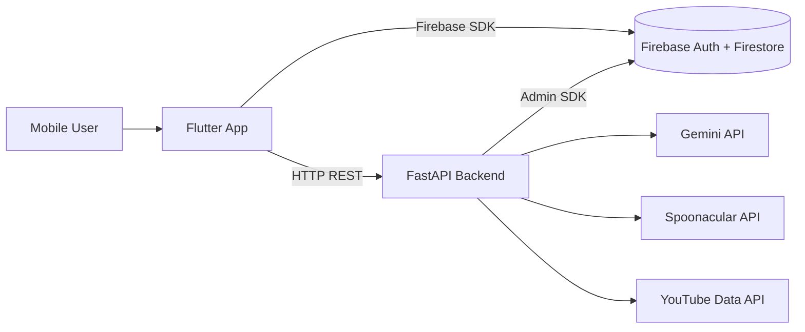

# 🍳 Cookgenix

<p align="center">
  
  
  
  
  
  
  
  
</p>

### Intelligent Cooking Companion – Full‑Stack Flutter + FastAPI System

Cookgenix is a production‑oriented full‑stack application that combines a **Flutter mobile client** with a **FastAPI backend** to deliver AI‑assisted cooking, structured pantry management, and automated meal planning.

The system is designed around three principles:

- **Reduce food waste** through inventory‑aware recommendations  
- **Accelerate kitchen decisions** using AI interpretation  
- **Keep architecture clean, modular, and scalable**  

---

## ✨ Core Capabilities

### 📷 Smart Ingredient Ingestion
- Camera‑based food scanning
- Grocery receipt parsing
- AI‑powered structured ingredient extraction
- Ingredient alias normalization (e.g., singular/plural mapping)

### 🧠 AI‑Driven Cooking Assistance
- Generate recipes from user cravings
- Suggest recipes from pantry inventory
- Structured step extraction and summaries
- YouTube cooking video discovery

### 📅 Automated Meal Planning
- Weekly meal plan generation
- Replace specific days dynamically
- Pantry‑aware recommendations
- Firestore‑backed persistence

### 🛒 Smart Shopping Workflows
- Missing ingredient detection
- Auto‑generated shopping lists
- Inventory synchronization after cooking

---

# 🏗 System Architecture

The architecture separates responsibilities between the mobile client, backend orchestration layer, and external AI/data providers.



### Architectural Responsibilities

**Flutter Application**
- UI rendering and user interaction flows
- Route management via go_router
- Local persistence (Hive)
- Direct Firebase Auth integration
- REST communication with backend

**FastAPI Backend**
- AI orchestration and provider abstraction
- Ingredient normalization engine
- Meal planner logic
- Inventory deduction
- Secure Firestore operations

**External Providers**
- Gemini → multimodal interpretation + AI recipe generation
- Spoonacular → recipe & planning data
- YouTube Data API → cooking video enrichment

---

# 🧩 Technology Stack

## Frontend
- Flutter (Dart)
- go_router
- Firebase Authentication
- Cloud Firestore
- Hive (local storage)
- flutter_dotenv

## Backend
- Python 3.11+
- FastAPI
- Pydantic
- Firestore Admin SDK
- Uvicorn

## AI & External APIs
- Gemini API
- Spoonacular (RapidAPI)
- YouTube Data API

---

# 📂 Repository Structure

```
MCH/
├── backend/
│   ├── app/
│   │   ├── api/           # Route groups (scan, recipes, planner, cravings)
│   │   ├── providers/     # External API adapters
│   │   ├── models/        # Pydantic schemas
│   │   ├── utils/         # Inventory & normalization logic
│   │   ├── core/          # Firestore initialization
│   │   ├── data/          # Ingredient alias datasets
│   │   └── main.py        # FastAPI entrypoint
│   └── requirements.txt
│
└── my_cooking_helper/
    ├── lib/
    │   ├── features/      # Domain-based UI modules
    │   ├── services/      # API + business orchestration
    │   ├── models/        # Client-side models
    │   ├── widgets/       # Shared UI components
    │   ├── theme/         # Theming system
    │   └── main.dart
    └── pubspec.yaml
```

The structure mirrors the system design described in the project documentation and final year report: domain separation, provider abstraction, and modular UI architecture.

---

# ⚙️ Operational Flow

1. User scans food or receipt in Flutter
2. Image is transmitted to FastAPI backend
3. Backend invokes AI provider for interpretation
4. Ingredients are normalized using alias dataset
5. Structured data is stored in Firestore
6. User may then:
   - Generate AI recipes
   - Build a weekly meal plan
   - Deduct inventory after cooking
   - Generate a shopping list

All computation‑heavy and sensitive operations are handled server‑side.

---

# 🔧 Local Development Setup

## Backend

```bash
cd backend
python -m venv .venv
source .venv/bin/activate   # Windows: .venv\Scripts\activate
pip install -r requirements.txt
uvicorn app.main:app --reload --port 8000
```

API Documentation:

```
http://localhost:8000/docs
```

---

## Frontend

```bash
cd my_cooking_helper
flutter pub get
flutter run
```

Ensure `.env` files are configured before running.

---

# 🔐 Environment Variables

## Backend

```
GEMINI_API_KEY=
RAPIDAPI_KEY=
YOUTUBE_API_KEY=
GOOGLE_CLOUD_PROJECT=
GCP_SA_KEY_JSON=
```

## Frontend

```
SERVER_URL=
IP=
PORT=
```

Do not commit secrets to version control.

---

# 📈 Future Enhancements

- Dockerized deployment
- CI/CD pipeline
- API versioning strategy
- Rate limiting & monitoring
- Nutrition tracking module
- Expiry‑based pantry notifications
- Caching layer for external APIs

---

# 👨‍💻 Author

Adeetya Doollah  
BSc (Hons) Applied Computing – 2025  
University of Mauritius  

**Project Duration:** 21 May 2025 – 09 November 2025

---

